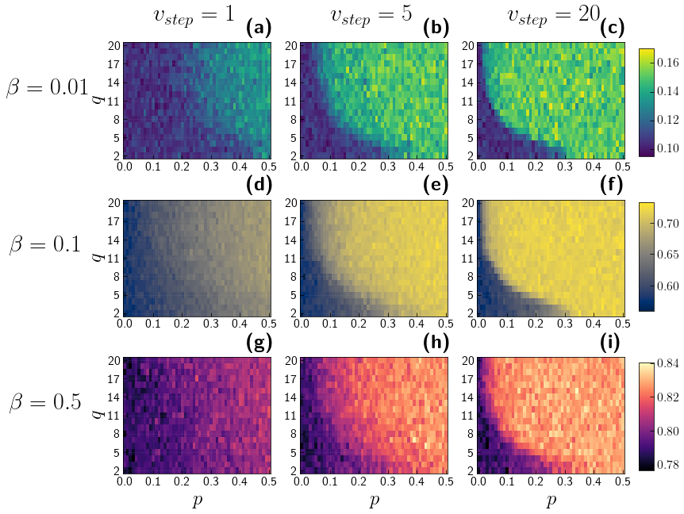

# Role of time scales in the coupled epidemic-opinion dynamics on multiplex networks

_Robert Jankowski, Anna Chmiel_

### Abstract

Modelling the epidemic spreading on multiplex networks considering complex human behaviours has recently gained the
attention of many scientists. In this work, we study the interplay between epidemic spreading and opinion dynamics on
multiplex networks. An agent in the epidemic layer could stay in one of the five distinct states, resulting in the SIRQD
model. Agent’s attitude towards respecting pandemics’ restrictions plays a crucial role in its prevalence. In our model,
the agent's point of view could be altered by either conformism mechanism, social pressure, or independent actions. As
the underlying opinion model, we leverage the $q$-voter model. The entire system constitutes a coupled opinion-dynamic
model where two distinct processes occur. The question arises of how to properly align these dynamics, i.e., whether
they should possess equal or disparate time scales. This paper highlights the impact of different time scales of opinion
dynamics on epidemic spreading, focusing on the time and the peak of infection.

### Results

The whole picture of the interplay between opinion and epidemic layer and the role of time scales is shown in Figure~
\ref{fig:heatmap}. We present the heatmaps of the peak of infection with varying group size $q$ and independence
probability $p$. The first column comprises the results for $v_{step}=1$, i.e., both opinion and epidemic dynamics have
the same time scale. One can observe that for lower independence probability, the peak of infection decreases, which is
in point with the results shown in Figure~\ref{fig:imax_vs_beta}. With $v_{step}=1$ the dependence of group size $q$ is
not very noticeable. However, for $v_{step}=5$, i.e., when for one epidemic step, five updates on the opinion layer are
performed, interesting patterns are starting to emerge. Namely, when $q$ is very large, we need to keep the independence
probability low to reduce the peak of infection. In contrast, we are free to introduce the higher level of agents'
independence for smaller group sizes while keeping the identical value of infection's peak. This phenomenon is more
pronounced with greater $v_{step}$ (third column, $v_{step}=20$) and is not dependent on the infection probability
$\beta$. In each of these two phases, the maximum infection value remains relatively stable. % All these results are
debated in the society of agents with a positive opinion. All these results are debated considering the population of
agents with initial positive opinions, i.e., with $o_{init}=1$. On the other hand, in the case of a society with
initially negative agents, one could assume opposite conclusions. An increase in independence probability would
introduce the more significant noise in the system and, as a result, decrease the peak of infection. We presume a very
similar behaviour as in Figure~\ref{fig:heatmap} however, with higher values in the bottom left regions and lower
elsewhere.

### Citation

_under review_