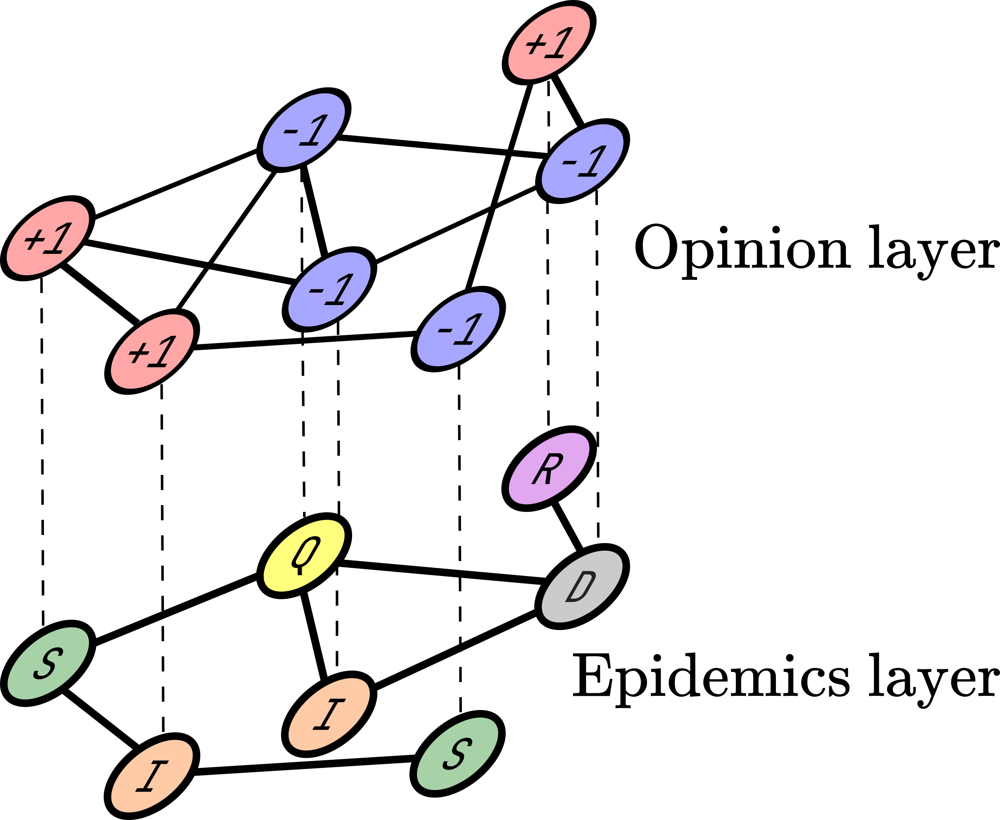

# Role of time scales in the coupled epidemic-opinion dynamics on multiplex networks

_Robert Jankowski, Anna Chmiel_

### Abstract

Modelling the epidemic spreading on multiplex networks considering complex human behaviours has recently gained the
attention of many scientists. In this work, we study the interplay between epidemic spreading and opinion dynamics on
multiplex networks. An agent in the epidemic layer could stay in one of the five distinct states, resulting in the SIRQD
model. Agent’s attitude towards respecting pandemics’ restrictions plays a crucial role in its prevalence. In our model,
the agent's point of view could be altered by either conformism mechanism, social pressure, or independent actions. As
the underlying opinion model, we leverage the $q$-voter model. The entire system constitutes a coupled opinion-dynamic
model where two distinct processes occur. The question arises of how to properly align these dynamics, i.e., whether
they should possess equal or disparate time scales. This paper highlights the impact of different time scales of opinion
dynamics on epidemic spreading, focusing on the time and the peak of infection.

Representation of the opinion-epidemic model. The upper (opinion) layer considers dynamics of opinion, and nodes possess
two possible states: positive (+1) or negative (-1). This layer also contains additional connections between agents. The
lower (epidemic) layer supports the spread of disease. The nodes are the same agents as in the opinion layer, but their
states here can be either (S) susceptible, (I) infected, (Q) quarantined, (D) deceased or (R) recovered.

### Citation

> Jankowski, R.; Chmiel, A. Role of Time Scales in the Coupled Epidemic-Opinion Dynamics on Multiplex Networks. Entropy 2022, 24, 105. https://doi.org/10.3390/e24010105 
